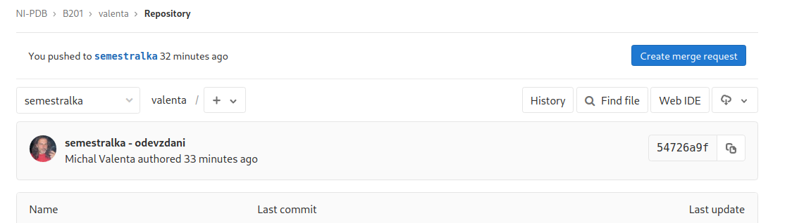
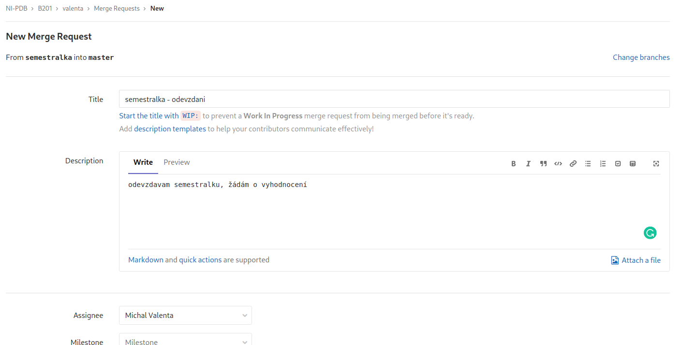

# Semestrální práce - pokyny

## Forma a požadavky

* viz link:https://courses.fit.cvut.cz/NI-PDB/classification/zapocet-2020/index.html[course pages -> hodnocení -> získání zápočtu]

## Způsob odevzdání

* každý student má v rámci předmětu NI-PDB a semestru k dispozici privátní GIT archiv
** **https://gitlab.fit.cvut.cz/NI-PDB/<kód semestru>/<username>** (například: https://gitlab.fit.cvut.cz/NI-PDB/B201/valenta)
* branch **master** obsahuje pouze tyto pokyny a do něj **nemůžete udělat commit**
* udělejte si tedy **libovolný branch** (např. semestralka) a v něm práci vypracujte
* **odevzdání** realizujete tak, že vytvoříte **merge request** mezi vaším branch a branch commit a **přiřadíte ho uživateli valenta (pole "Assignee")**
** v rámci diskuse na tímto požadavkem (request) případně budeme řešit požadavky na doplnění apod.

TIP: Pokud nejste zběhlí v práci s GIT, zkuste link:https://gitlab.fit.cvut.cz/BI-SQL/homeworks[návod pro studenty BI-SQL]. Níže na stránce jsou uvedeny i konkrétní příkazy jak tímto způsobem s GITem pracovat a úlohu odevzdat.

NOTE: Pokud odevzdáváte semestrálku ve dvojici (a máte to ode mě schválené), použijte projekt jednoho s vás a na vhodných místech napište, že autoři jsou dva a kdo je ten druhý.

## Ohodnocení

* práci okomentuji a ohodnotím v rámci vypořádání **merge request** (viz výše)
* body zapíšu do systému link:https://grades.fit.cvut.cz/courses/NI-PDB/[grades]

## Odevzdání = vytvoření merge request + a přiřazení vyučujícímu

### Krok 1 - vytvoříte merge request mezi master a branch s vypracovanou semestrálkou

[#merge-request-1]
[caption="Vytvoření merge request"]

### Krok 2 - přiřadíte ho uživateli Valenta (Assignee bude Michal Valenta)

.přiřazení uživatele
[#merge-request-2]
[caption="Přiřazení uživatele (Assignee)"]

